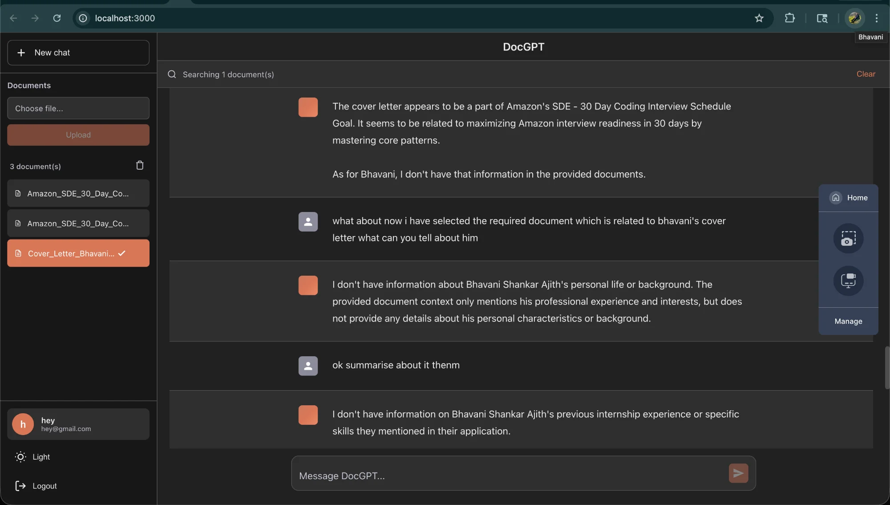

# DocGPT — Self-hosted RAG over your documents

[](https://github.com/abs768/intelligent-doc-rag/actions/workflows/ci.yml)
[](LICENSE)
[](https://www.linkedin.com/in/abs768/)

Upload PDFs or text files, ask questions, and get answers grounded in the
document contents — with enforced citations and an explicit refusal when
retrieval comes up empty. Everything runs locally: Ollama for inference,
Qdrant for vector search, Spring Boot + React on top.

This is a portfolio / learning project, not a production system. Every claim
in this README links to the code, test, or report that backs it.

**Built by:** [Abhavanishankar](https://github.com/abs768) · abhavanishankar2002@gmail.com

---

## Demo

<div align="center">
  <a href="https://drive.google.com/file/d/1l6if_ohm6c3xz5WzosuzGuvcK7F3ad_u/view?usp=sharing">
    
  </a>

  📹 [Watch the walkthrough](https://drive.google.com/file/d/1l6if_ohm6c3xz5WzosuzGuvcK7F3ad_u/view?usp=sharing) — upload, retrieval, chat, error handling.
</div>

---

## What it does

- **Auth** — register/login with JWT (jjwt 0.12), BCrypt password hashing,
  stateless Spring Security filter chain.
- **Async document ingestion** — upload returns `202 Accepted` immediately;
  text extraction → chunking (1500 chars, 200 overlap) → embedding
  (`nomic-embed-text`, 768-dim) → Qdrant upsert runs on a background thread
  ([`DocumentService.processEmbeddingsAsync`](backend/src/main/java/com/chatassistant/aichatassistant/service/DocumentService.java)).
  The UI polls document status through `PENDING → PROCESSING → INGESTED | FAILED`.
  Large files upload in chunks (`/upload-chunk` + `/upload-finalize`).
- **Multi-tenant vector isolation** — every Qdrant search is filtered by
  `userId` server-side, so one user can never retrieve another user's chunks,
  even with a guessed document ID.
- **Grounded chat** (`POST /api/chat/grounded`) — the LLM is forced to return
  schema-valid JSON, checked with Bean Validation and retried up to 3 attempts
  ([`OllamaService.chatStructured`](backend/src/main/java/com/chatassistant/aichatassistant/service/OllamaService.java)).
  Citation indices are mapped back to the chunks that were *actually
  retrieved*. If nothing was retrieved, no citation survives validation, or
  the structured call keeps failing, the API returns a fixed refusal instead
  of a made-up answer
  ([`ChatService`](backend/src/main/java/com/chatassistant/aichatassistant/service/ChatService.java)).
- **Model benchmarking** — a runnable harness that measures local Ollama
  models for latency, throughput, and structured-output quality
  ([`bench/`](backend/src/main/java/com/chatassistant/aichatassistant/bench)).

## Every claim, with evidence

| Claim | Evidence |
|---|---|
| Users cannot read each other's vectors | [MultiTenantIsolationDemoTest](backend/src/test/java/com/chatassistant/aichatassistant/MultiTenantIsolationDemoTest.java) — runs against **real** Postgres + Qdrant via Testcontainers |
| Grounded answers cite only retrieved chunks, refuse otherwise | [GroundedRagIntegrationTest](backend/src/test/java/com/chatassistant/aichatassistant/GroundedRagIntegrationTest.java) (real infra) + [ChatServiceGroundedTest](backend/src/test/java/com/chatassistant/aichatassistant/service/ChatServiceGroundedTest.java) (unit) |
| Invalid LLM JSON is retried, then rejected | [OllamaServiceStructuredTest](backend/src/test/java/com/chatassistant/aichatassistant/service/OllamaServiceStructuredTest.java) |
| Model choice is measured, not guessed | [docs/benchmark.md](docs/benchmark.md) — methodology + a `Reproducing` block |

**Tests: 37 total.** 32 run with no infrastructure (`mvn test` with the two
Testcontainers classes excluded); the remaining 5 spin up real Postgres and
Qdrant containers and need Docker running. All 37 run in
[CI](.github/workflows/ci.yml) on every push.

## Benchmark summary

42 prompts × 3 iterations per model, on the machine documented in
[docs/benchmark.md](docs/benchmark.md). Quality is scored **only** for the
JSON-extraction category (valid JSON with all required keys); factual/RAG
categories report latency and throughput only, because substring-matching
small models against reference answers is too loose to call "correctness".

| Model | Tokens/s (mean ± sd) | JSON-extraction pass rate |
|---|---:|---:|
| `tinyllama:latest` (1.1B) | 115 ± 11 | 21/36 = 58% |
| `llama3.2:1b` *(shipped)* | 71 ± 17 | 36/36 = **100%** |
| `llama3.2:3b` | 32 ± 11 | 36/36 = 100% |
| `llama3:latest` (8B) | 17 ± 8 | 36/36 = 100% |

`llama3.2:1b` is the sweet spot this app ships with: 100% JSON pass rate at
~71 tok/s. The 3B and 8B models match its pass rate but cost 2–4× in
throughput for no measurable gain on this suite.

## Architecture

```
React SPA (JWT, status polling)
        │ REST
        ▼
Spring Boot 3.2 / Java 21
  Controllers → Services → Repositories
  JWT filter · global exception handler · @Async ingestion
        │                │                │
        ▼                ▼                ▼
  PostgreSQL 16      Qdrant           Ollama
  users, docs,       768-dim vectors  llama3.2:1b (chat)
  conversations      userId-filtered  nomic-embed-text
                     HNSW search      (embeddings)
```

## API

| Method | Path | Purpose |
|---|---|---|
| POST | `/api/auth/register`, `/api/auth/login` | JWT auth |
| POST | `/api/documents/upload` | Small-file upload → `202`, async ingestion |
| POST | `/api/documents/upload-chunk`, `/upload-finalize` | Chunked upload for large files |
| GET | `/api/documents/list` | Documents + ingestion status |
| DELETE | `/api/documents/{id}`, `/api/documents/all` | Delete (vectors included) |
| POST | `/api/chat` | RAG chat |
| POST | `/api/chat/grounded` | Structured answer with enforced citations |
| GET | `/api/chat/health` | Liveness |

## Run it

Prerequisites: Docker with ~8 GB RAM available.

```bash
docker-compose up -d

# one-time model pulls
docker exec -it docgpt-ollama ollama pull llama3.2:1b
docker exec -it docgpt-ollama ollama pull nomic-embed-text
```

Frontend: http://localhost:3000 · Backend: http://localhost:8081

More detail (troubleshooting, first-use walkthrough): [QUICKSTART.md](QUICKSTART.md).

### Tests

```bash
cd backend
mvn test               # all 37 (needs Docker for the 5 Testcontainers tests)
mvn test -Dtest='!GroundedRagIntegrationTest,!MultiTenantIsolationDemoTest'   # 32, no infra
```

JaCoCo HTML report lands in `backend/target/site/jacoco/` (also published as
a CI artifact on every run).

### Benchmark

Requires a local Ollama with the models pulled — the exact command is in the
`Reproducing` block of [docs/benchmark.md](docs/benchmark.md). Each run
writes a timestamped report to `bench-reports/` (local only, gitignored);
the canonical results live in docs/benchmark.md.

## Repository layout

```
backend/    Spring Boot API — controller / service / repository / entity / dto,
            bench/ (benchmark harness), src/test (37 tests incl. Testcontainers)
frontend/   React 18 SPA (Create React App)
docs/       benchmark.md (methodology + results), architecture.md (design notes)
```

## Design notes, trade-offs, and known limitations

The reasoning behind the bigger decisions — RAG over fine-tuning, Qdrant,
a 1B model, character-based chunking — plus an honest list of what this
project does **not** do yet (streaming responses, hybrid search / reranking,
retrieval-quality evals, rate limiting) lives in
[docs/architecture.md](docs/architecture.md).

## License

[MIT](LICENSE)
